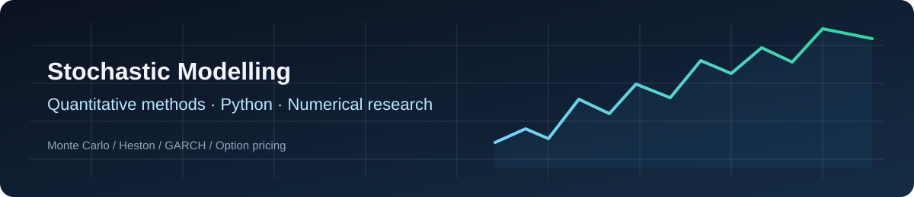

<div align="center">



# Stochastic Modelling & Quantitative Methods

**Five Python experiments · numerical methods, derivative pricing and volatility modelling**

[](https://www.python.org/) [](#scope-and-limitations) [](#checks-and-reproducibility)

</div>

## Overview

This portfolio explores stochastic differential equations, Monte Carlo estimators, European option pricing, stochastic volatility and conditional variance. The five projects progress from a controlled numerical example to models fitted to downloaded market quotes. All results are exploratory: **there are no claims of predictive trading performance**.

## Projects

| Study | Research question | Python |
| :-- | :-- | :-- |
| **01 · Geometric Brownian motion** | How does Euler–Maruyama compare with an exact solution on the *same* Brownian path? | [Source](projects/quant_finance/project1_sde_simulator.py) |
| **02 · European option pricing** | How does Monte Carlo sampling error compare with the Black–Scholes reference? | [Source](projects/quant_finance/project2_montecarlo_eu_option_pricing.py) |
| **03 · Heston simulation** | How do correlated asset-price and variance shocks affect sample paths and European payoffs? | [Source](projects/quant_finance/project3_heston_model.py) |
| **04 · Heston calibration** | How well does an analytical European-call model fit filtered live TSLA call quotes? | [Source](projects/quant_finance/project4_heston_calibration.py) |
| **05 · GARCH(1,1)** | How does a Gaussian conditional-variance model fit historical TSLA returns? | [Source](projects/quant_finance/project5_GARCH.py) |

## Mathematical foundations

The first experiment compares an Euler–Maruyama approximation against the exact geometric-Brownian-motion path driven by the **same Wiener increments**:

$$
dS_t=\mu S_t\,dt+\sigma S_t\,dW_t,\qquad S_t=S_0\exp[(\mu-\tfrac12\sigma^2)t+\sigma W_t].
$$

The fifth experiment fits a GARCH(1,1) conditional variance recursion:

$$
h_t=\omega+\alpha(r_{t-1}-\mu)^2+\beta h_{t-1}.
$$

## Checks and reproducibility

A local run of the published **core** tests and an expanded companion suite completed **13/13 offline checks** on 16 September 2026. The extra tests exercise fixed-path GBM refinement, Black–Scholes monotonicity, Heston strike ordering on common paths and a synthetic GARCH fit. This is a local check, **not a GitHub Actions result or a full validation of the market-data calibration**. To run the same tests yourself:

```bash
python -m venv .venv
# Activate the environment for your operating system.
python -m pip install -r requirements.txt
python -m unittest discover -s tests -v
```

Run the first three demonstrations individually:

```bash
python projects/quant_finance/project1_sde_simulator.py
python projects/quant_finance/project2_montecarlo_eu_option_pricing.py
python projects/quant_finance/project3_heston_model.py
```

The calibration and GARCH demonstrations require live market data and additional packages, including QuantLib for calibration:

```bash
python -m pip install -r requirements-market.txt
python projects/quant_finance/project4_heston_calibration.py
python projects/quant_finance/project5_GARCH.py
```

## Scope and limitations

- Simulation demos use stochastic sampling and numerical discretisation. Their ordinary runs are unseeded, so outputs change between runs.
- The market-data scripts download current Yahoo Finance observations. No timestamped option-chain snapshot is included, and a past calibration cannot be exactly reconstructed from live quotes.
- Heston calibration prices *European* calls; TSLA listed options can have American exercise features. Flat interest and dividend assumptions are simplifications.
- GARCH estimation uses a Gaussian likelihood and fixed sample mean. A successful synthetic optimiser test is not an out-of-sample forecasting benchmark.
- Neither the code nor the tests substantiate a profitable trading strategy.

See [Reproducibility and model limitations](docs/REPRODUCIBILITY.md) for details.

**Author:** [Rodrigo Varela](https://github.com/rodrigoacvarela20-web) · Engineering Physics, Instituto Superior Técnico · MSc Quantum Fields and Fundamental Forces, Imperial College London (expected 2027).
